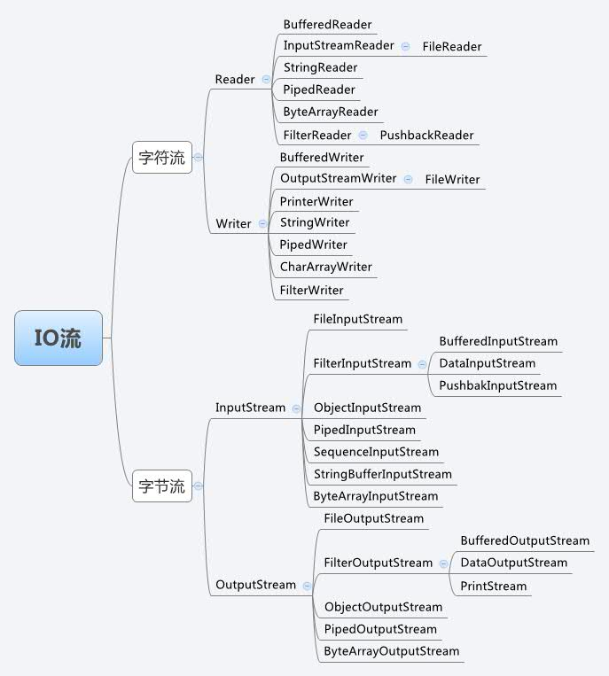

= io

== 类型

. 同步阻塞 I/O
. 同步非阻塞 I/O

    一个线程监听一个文件

. I/O 多路复用

    一个线程监听多个文件

. 信号驱动 I/O
. 异步 I/O

java 中

. BIO 同步阻塞
. NIO 多路复用

    Java 中的 NIO ，有一个非常重要的选择器 ( Selector ) 的概念，也可以被称为 多路复用器。

. AIO 异步

== IO 类

类继承关系

