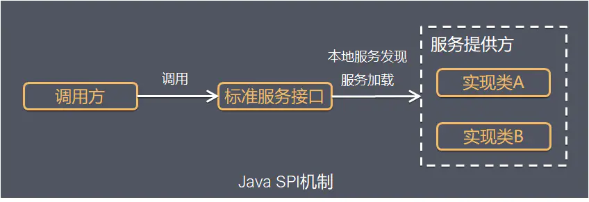

= SPI（Service Provider Interface）

实例：

. jdbc 驱动加载

实际上是“基于接口的编程＋策略模式＋配置文件”组合实现的动态加载机制。

[source,java]
----
public interface IShout {
    void shout();
}

public class Cat implements IShout {
    @Override
    public void shout() {
        System.out.println("miao miao");
    }
}

public class Dog implements IShout {
    @Override
    public void shout() {
        System.out.println("wang wang");
    }
}
----

[source,text]
----
# 位置
#- src
#    -main
#        -resources
#            - META-INF
#                - services
#                    - org.foo.demo.IShout

org.foo.demo.animal.Dog
org.foo.demo.animal.Cat

----

[source,java]
----
public class SPIMain {
    public static void main(String[] args) {
        ServiceLoader<IShout> shouts = ServiceLoader.load(IShout.class);
        for (IShout s : shouts) {
            s.shout();
        }
    }
}
----
