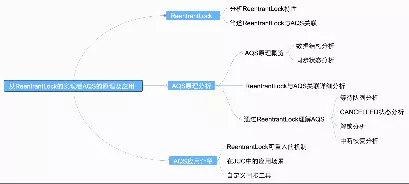
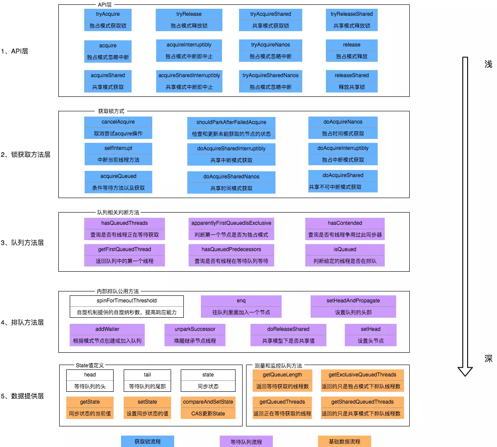
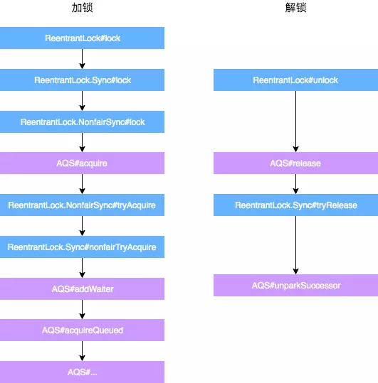

= AQS

AbstractQueuedSynchronizer，抽象的队列式同步器

使用了双向链表将等待线程链接起来，当发生并发竞争的时候，就会初始化该队列并让线程进入睡眠等待唤醒，同时每个节点会根据是否为共享锁标记状态为共享模式或独占模式。

加锁流程

. 非公平锁先通过 CAS 修改 state 尝试获取锁
. 公平锁和未取到锁的非公平锁执行 acquire(1)，先判定 state 状态，
.. 如果是 0 ，如果是公平锁，判定等待队列中是否存在有效的节点，不存在则和非公平锁一样，尝试修改 state 获取锁
.. 如果是 1 ，则判定取得锁的是否是当前线程，如果不是，则将当前线程加入等待队列
... 进入队列后进入 for 循环，判定是否前一个节点是否是头结点，如果是，则尝试获得锁，取得锁后，将当前线程的节点设置为头结点
... 如果前一个节点不是头结点，或者是头节点但未取到锁，要判断是否要阻塞当前线程，避免消耗资源
.. 取得锁后，如果线程中断过，则中断线程

解锁流程

. state 减一，判定当前线程是否取得锁，未取得锁则抛异常
. 判定 state 是否是 0，如果是 0，代表完全解锁，将当前线程从锁中移除
. 如果完全解锁，则从队列中取第一个线程，如果不为 null，判定是否需要唤醒，如果需要，则唤醒该线程

