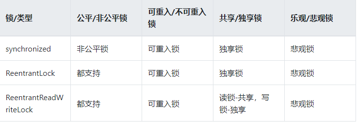
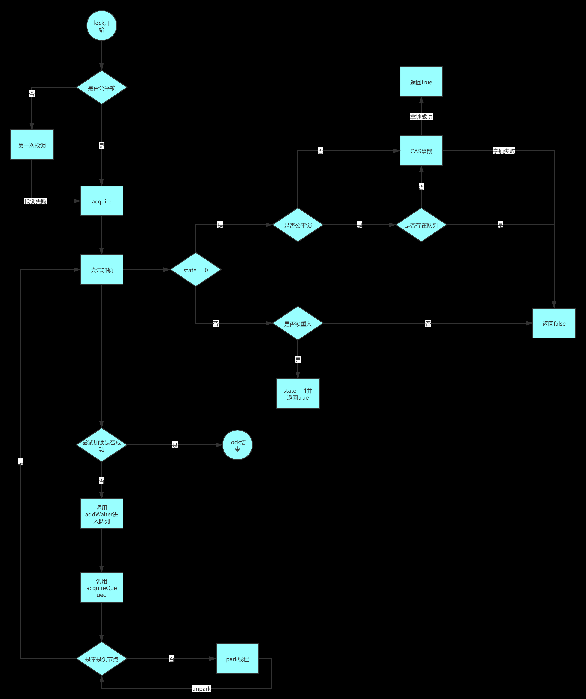
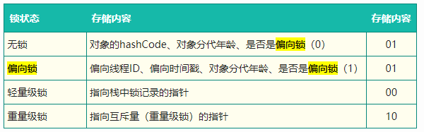

= 锁

- 乐观锁与悲观锁
- 自旋锁
- 重入锁
- 轮询锁与定时锁
- 读写锁
- 共享锁和独享锁
- 分段锁

乐观锁：CAS

image:.readme_images/锁类型2.png[]

== synchronized

synchronized 通过 Monitor 来实现线程同步，Monitor 是依赖于底层的操作系统的 Mutex Lock（互斥锁）来实现的线程同步。

如同我们在自旋锁中提到的阻塞或唤醒一个Java线程需要操作系统切换CPU状态来完成，这种状态转换需要耗费处理器时间。

如果同步代码块中的内容过于简单，状态转换消耗的时间有可能比用户代码执行的时间还要长”。

这种方式就是 synchronized 最初实现同步的方式，这就是 JDK6 之前 synchronized 效率低的原因。

这种依赖于操作系统 Mutex Lock 所实现的锁我们称之为“重量级锁”，JDK6 中为了减少获得锁和释放锁带来的性能消耗，引入了“偏向锁”和“轻量级锁”。

== 不可重入锁

若当前线程执行某个方法已经获取了该锁，那么在方法中尝试再次获取锁时，就会获取不到被阻塞。

== 可重入锁

线程可以进入它“已经拥有”的锁的同步代码块

- synchronized

    基于 JVM 实现
    非公平锁
    后来引入自旋锁，和 ReentrantLock 性能差不多
    测试：嵌套调用

- ReentrantLock

    JDK 实现
    公平锁
    自旋锁

自旋锁：不会使线程进入阻塞状态，循环调用 CAS

想尽办法避免线程进入内核的阻塞状态是我们去分析和理解锁设计的关键钥匙（逻辑层上控制锁）。

== 自旋锁 VS 适应性自旋锁

JDK 6 中变为默认开启 自旋锁

自适应意味着自旋的时间（次数）不再固定，而是由前一次在同一个锁上的自旋时间及锁的拥有者的状态来决定。

== 锁状态

锁状态，只能升级不能降级：无锁 VS 偏向锁 VS 轻量级锁 VS 重量级锁

=== 偏向锁

一段同步代码一直被一个线程所访问，那么该线程会自动获取锁，降低获取锁的代价。

=== 轻量级锁

是指当锁是偏向锁的时候，被另外的线程所访问，偏向锁就会升级为轻量级锁，其他线程会通过自旋的形式尝试获取锁，不会阻塞，从而提高性能。

若当前只有一个等待线程，则该线程通过自旋进行等待。但是当自旋超过一定的次数，或者一个线程在持有锁，一个在自旋，又有第三个来访时，轻量级锁升级为重量级锁。

=== 重量级锁

升级为重量级锁时，锁标志的状态值变为“10”，此时Mark Word中存储的是指向重量级锁的指针，此时等待锁的线程都会进入阻塞状态。

== 公平/非公平锁

=== 公平锁

公平锁是指多个线程按照申请锁的顺序来获取锁，线程直接进入队列中排队，队列中的第一个线程才能获得锁。

公平锁的优点是等待锁的线程不会饿死。

缺点是整体吞吐效率相对非公平锁要低，等待队列中除第一个线程以外的所有线程都会阻塞，CPU唤醒阻塞线程的开销比非公平锁大。

=== 非公平锁

优点是可以减少唤起线程的开销，整体的吞吐效率高，因为线程有几率不阻塞直接获得锁，CPU不必唤醒所有线程。
缺点是处于等待队列中的线程可能会饿死，或者等很久才会获得锁。

== 共享/独享锁

. ReentrantReadWriteLock

    读锁、写锁
