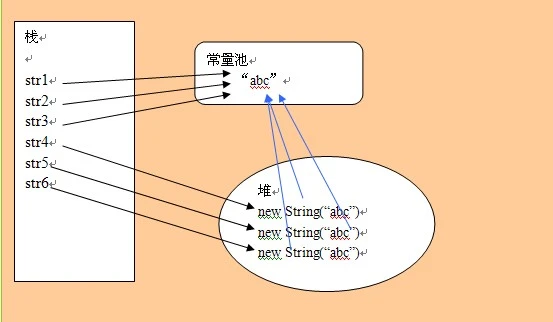

= 字符串常量池

== 使用常量池情况

. `String string = "1"`

== 不使用常量池情况

. `new Integer(1)`

== example

[source,text]
----
String str1 = new String("A"+"B") ; 会创建多少个对象?
String str2 = new String("ABC") + "ABC" ; 会创建多少个对象?

str1：
字符串常量池："A","B","AB" : 3个
堆：new String("AB") ：1个
引用： str1 ：1个
总共 ： 5个

str2 ：
字符串常量池："ABC" : 1个
堆：new String("ABC") ：1个
引用： str2 ：1个
总共 ： 3个
----

== 添加到常量池

`String.intern()` 返回一个保留池字符串（没有则新增）
