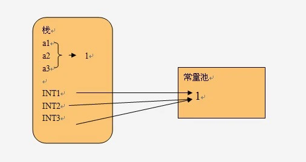

= 整型常量池

范围：`-128 - 127`

== 使用常量池情况

. `Integer.valueOf(1)`
. `Integer integer = 1`，底层就是第一种

== 不使用常量池情况

. `new Integer(1)`

== example

基础类型的变量和常量，变量和引用存储在栈中，常量存储在常量池中

[source,text]
----
int a1 = 1;
int a2 = 1;
int a3 = 1;

public static int INT1 =1 ;
public static int INT2 =1 ;
public static int INT3 =1 ;
----

