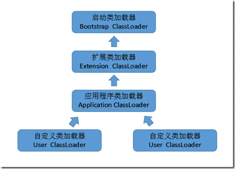
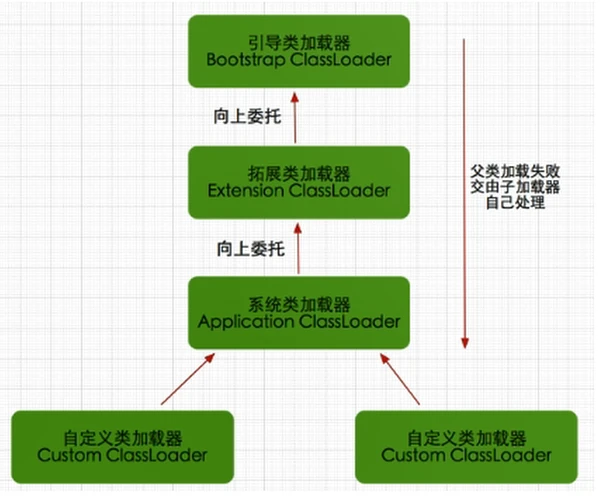

= 类加载器

类加载器

双亲委派机制

作用：
1. 避免类重复加载
2. 保证了 Java 的核心 API 不被篡改

== 启动类加载器

jvm 的启动是通过引导类加载器（bootstrap class loader）创建一个初始类（initial class）来完成的，这个类是由jvm的具体实现指定的。

使用C/C++语言实现的，嵌套在JVM内部，java程序无法直接操作这个类。

它用来加载Java核心类库，如：JAVA_HOME/jre/lib/rt.jar、resources.jar、sun.boot.class.path路径下的包，用于提供jvm运行所需的包。

并不是继承自java.lang.ClassLoader，它没有父类加载器

它加载扩展类加载器和应用程序类加载器，并成为他们的父类加载器

出于安全考虑，启动类只加载包名为：java、javax、sun开头的类

== 扩展类加载器

Java语言编写，由sun.misc.Launcher$ExtClassLoader实现，我们可以用Java程序操作这个加载器
派生继承自java.lang.ClassLoader，父类加载器为启动类加载器

从系统属性：java.ext.dirs目录中加载类库，或者从JDK安装目录：jre/lib/ext目录下加载类库。我们就可以将我们自己的包放在以上目录下，就会自动加载进来了。

== 应用程序类加载器

Java语言编写，由sun.misc.Launcher$AppClassLoader实现。
派生继承自java.lang.ClassLoader，父类加载器为启动类加载器

它负责加载环境变量classpath或者系统属性java.class.path指定路径下的类库

它是程序中默认的类加载器，我们Java程序中的类，都是由它加载完成的。

我们可以通过ClassLoader#getSystemClassLoader()获取并操作这个加载器

== 自定义类加载器
