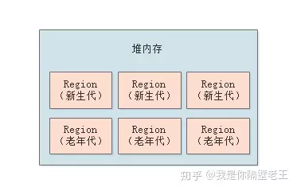

= GC收集器

== ZGC（>=17，默认还是 G1）

== G1收集器 (>9, default, 大堆使用(>4gb))

什么情况下应该考虑使用G1

. 实时数据占用超过一半的堆空间
. 对象分配或者晋升的速度变化大
. 希望消除长时间的 GC 停顿（超过0.5-1秒）

依旧存在新生代老年代的概念，但是没有严格区分。Region最多分为2048个

低延迟，吞吐量受影响，多线程 GC

G1收集器的内存结构完全区别于CMS，弱化了CMS原有的分代模型（分代可以是不连续的空间），将堆内存划分成一个个Region（1MB~32MB,   默认2048个分区）,这么做的目的是在进行收集时不必在全堆范围内进行。

它主要特点在于 `达到可控的停顿时间`，用户可以指定收集操作在多长时间内完成，即G1提供了接近实时的收集特性。

G1的特点

. 并行与并发

    G1充分发挥多核性能，使用多CPU来缩短Stop-The-world的时间，

. 分代收集

    G1能够自己管理不同分代内已创建对象和新对象的收集。

. 空间整合：

    G1从整体上来看是基于 `标记-整理` 算法实现，从局部（相关的两块Region）上来看是基于 `复制` 算法实现，这两种算法都不会产生内存空间碎片。

. 可预测的停顿：

    它可以自定义停顿时间模型，可以指定一段时间内消耗在垃圾回收商的时间不大于预期设定值。

== Parallel Collector 并行GC (<= 8, server jvm default)

大吞吐量，延迟受影响，多线程 GC

新生代：复制算法

老年代：标记整理

== Serial Collector 串行GC

适用于单线程机器，小内存（<100mb）

== CMS收集器 (<14)

低延迟，CPU 敏感，会影响延迟，内存碎片

CMS（Concurrent Mark Sweep）收集器是一种以获取最短回收停顿时间为目标的收集器，基于并发 `标记清理` 实现,在标记清理过程中不会导致用户线程无法定位引用对象。

牺牲吞吐量为代价来获得最短停顿时间的垃圾回收器，主要适用于对响应时间的侧重性大于吞吐量的场景。

仅作用于 `老年代` 收集。

优点：

. 支持并发收集.
. 低停顿

    因为CMS可以控制将耗时的两个stop-the-world操作保持与用户线程恰当的时机并发执行，并且能保证在短时间执行完成，这样就达到了近似并发的目的.

缺点：

. CMS收集器对CPU资源非常敏感

    在并发阶段虽然不会导致用户线程停顿，但是会因为占用了一部分CPU资源，如果在CPU资源不足的情况下应用会有明显的卡顿。

. 无法处理浮动垃圾：

    在执行 `并发清理` 步骤时，用户线程也会同时产生一部分可回收对象，但是这部分可回收对象只能在下次执行清理是才会被回收。如果在清理过程中预留给用户线程的内存不足就会出现 `Concurrent Mode Failure`,一旦出现此错误时便会切换到SerialOld 收集方式。

. CMS清理后会产生大量的内存碎片

    当有不足以提供整块连续的空间给新对象/晋升为老年代对象时又会触发FullGC。且在1.9后将其废除。
