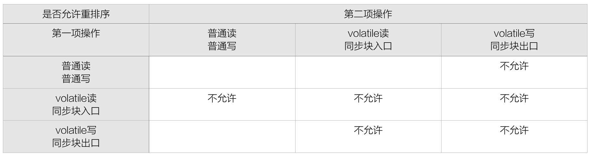
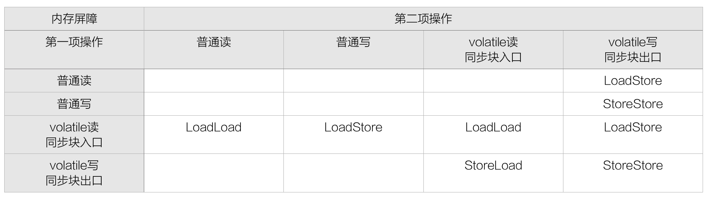

= 重排序-内存屏障

通过 volatile 标记，可以解决编译器层面的可见性与重排序问题。而内存屏障则解决了硬件层面的可见性与重排序问题。

== 指令重排序 / 乱序执行

只要不影响程序单线程、顺序执行的结果，就可以对两个指令重排序。

意义-提高性能

. 减少对象创建

    String d = "a" + "b";
    String c = "ab";
    先执行后一条，"a" + "b" 就不需要创建对象了，直接从字符串常量池取

. 提高 CPU 执行效率

    因为一个汇编指令也会涉及到很多步骤，每个步骤可能会用到不同的寄存器，现在的CPU一般采用流水线来执行指令，也就是说，CPU有多个功能单元（如获取、解码、运算和结果），一个指令的执行被分成：取指、译码、访存、执行、写回、等若干个阶段，**流水线是并行的, **第一条指令执行还没完毕，就可以执行第二条指令，前提是这两条指令功能单元相同或类似，所以一般可以通过指令重排使得具有相似功能单元的指令接连执行来减少流水线中断的情况。

发生时机

. 将字节码编译成机器码的阶段
. 在CPU执行的时候，也会适当对指令进行重排

Java内存模型关于重排序的规定

留白的单元格代表允许在不违反Java基本语义的情况下重排序。例如，编译器不会对对同一内存地址的读和写操作重排序，但是允许对不同地址的读和写操作重排序。

== volatile

声明 volatile 可禁止指令重排序

一旦一个共享变量（类的成员变量、类的静态成员变量）被 volatile 修饰之后，那么就具备了两层语义：

1）保证了不同线程对这个变量进行操作时的可见性，即一个线程修改了某个变量的值，这新值对其他线程来说是立即可见的。

2）禁止进行指令重排序。

== 内存屏障

volatile 通过内存屏障可以禁止指令重排序，内存屏障是一个CPU的指令，它可以保证特定操作的执行顺序。

内存屏障可以被分为以下几种类型：

. LoadLoad屏障

    对于这样的语句Load1; LoadLoad; Load2，在Load2及后续读取操作要读取的数据被访问前，保证Load1要读取的数据被读取完毕。

. StoreStore屏障

    对于这样的语句Store1; StoreStore; Store2，在Store2及后续写入操作执行前，保证Store1的写入操作对其它处理器可见。

. LoadStore屏障

    对于这样的语句Load1; LoadStore; Store2，在Store2及后续写入操作被刷出前，保证Load1要读取的数据被读取完毕。

. StoreLoad屏障

    对于这样的语句Store1; StoreLoad; Load2，在Load2及后续所有读取操作执行前，保证Store1的写入对所有处理器可见。它的开销是四种屏障中最大的。在大多数处理器的实现中，这个屏障是个万能屏障，兼具其它三种内存屏障的功能。

